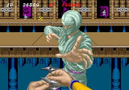

# Shuriken

*A tool to throw confs around like a ninja*

# Why another script?

Shuriken is a tool to facilitate the tedious task of copying config files and ssh keys across servers; to do so it follows a very minimalist approach based on the clipboard and script generation, rather than using scp and dealing with file permissions.

When a file is imported from stdin, Shuriken detects what it is and imports it into its repository (usually in `~/.shuriken`) where all public keys and configurations are stored.

When an ssh key is exported (from the shuriken repository or an absolute path to a file) Shuriken will prepare a script ready to be pasted in from the clipboard, containing commands to create the user if doesn't exists, copy the ssh key file in place and set the correct permissions.

# License

Copyright (C) 2017 Dyne.org Foundation

Shuriken is designed, written and maintained by Denis Roio <jaromil@dyne.org>

This source code is free software; you can redistribute it and/or
modify it under the terms of the GNU Public License as published by
the Free Software Foundation; either version 3 of the License, or
(at your option) any later version.

This source code is distributed in the hope that it will be useful,
but WITHOUT ANY WARRANTY; without even the implied warranty of
MERCHANTABILITY or FITNESS FOR A PARTICULAR PURPOSE.  Please refer
to the GNU Public License for more details.

You should have received a copy of the GNU Public License along with
this source code; if not, write to: Free Software Foundation, Inc.,
675 Mass Ave, Cambridge, MA 02139, USA.
